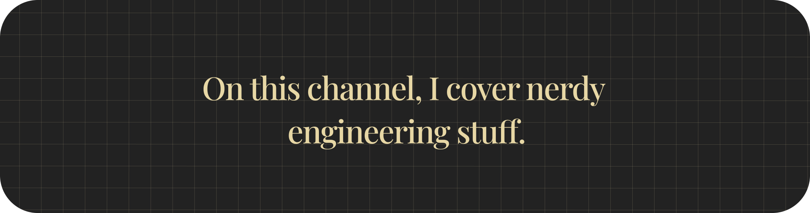

# Hi there, I am Shadi El-Fares 👋🏽 
I'm a second-year Software Engineering student [@ McMaster University](https://www.eng.mcmaster.ca/)! Thank you for stopping by! I make engineering related youtube videos on Calculus, DSA, and even thermite... 👀 

I'm into **startups**, **AI**, and *very deep philosophical conversations*.

- Check out my [portfolio](https://shadielfares.me) to learn more about me.
- Or my youtube channel!
- 

---

## 🔭 What I’m Currently Working On
~~A Data Structures and Algorithms crash course!~~ - I found something cooler to build.
HardLessonsDoneRight (HLDR) - become a better developer without cheating yourself out of the hard-times.

---

---

## 📦 Toolbox

### **Languages**

### **Frameworks & Libraries**

### **Tools & Platforms**

### **Databases & DevOps**

### **Editors & IDEs**

### **Miscellaneous Technologies**

---

## 📫 How to Reach Me

)

<!--  -->

<!--
**shadielfares/shadielfares** is a ✨ _special_ ✨ repository because its `README.md` (this file) appears on your GitHub profile.

Here are some ideas to get you started:

- 🔭 I’m currently working on ...
- 🌱 I’m currently learning ...
- 👯 I’m looking to collaborate on ...
- 🤔 I’m looking for help with ...
- 💬 Ask me about ...
- ⚡ Fun fact: ...
-->
